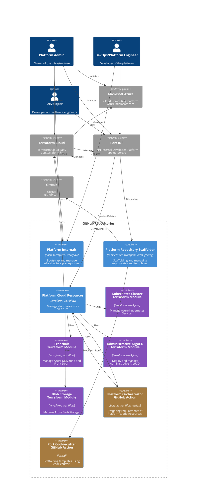

# Pashmak Guru: A Learning Journey in Infrastructure-as-Code (IaC)

> [!NOTE]  
> Please be advised that this project is currently in its development phase. As such, not all features and functionalities are fully implemented at this moment.

## Introduction to Pashmak Guru

Pashmak Guru is a GitHub organization where we, as a team of learners and enthusiasts, explore the principles of Infrastructure-as-Code (IaC). We use Terraform modules to build infrastructure on Microsoft Azure, to learn various topics and keep them here for people who are interested in learning too. This organization demonstrates how IaC can be applied, albeit not with the polish of a production-ready project. See the [Pashmak Guru repositories](https://github.com/orgs/PashmakGuru/repositories).

## Our Approach

- **Practical Examples with Terraform and Azure:** We provide examples and experiments that we conduct in real-time, showcasing our learning journey in creating infrastructure on Azure.
- **Integration with Port Internal Developer Platform:** We use this platform as part of our learning to understand better how different tools work together.

## Architecture
Here is a C4 component-level diagram of the whole organization IaC and IDP integration:

## Who Is This For

- **Aspiring Cloud Enthusiasts:** Perfect for those who are starting their journey in cloud computing and want to learn alongside a team doing the same.
- **Students & Hobbyists:** If you're interested in exploring cloud infrastructure and IaC, our repositories offer real-time learning scenarios.

## Getting Started

Dive into our repositories, each equipped with instructions and insights into our learning process. Pick any project that interests you and follow along.

## Contributing

We welcome contributions of all kinds! Feel free to suggest improvements, share your learning, or even help us understand best practices.

## Connect With Us

Join our journey and share your experiences. We’re all learning together and your input is valuable in this shared path. Let's [discuss](https://github.com/PashmakGuru/.github/discussions/categories/general) about your ideas!
